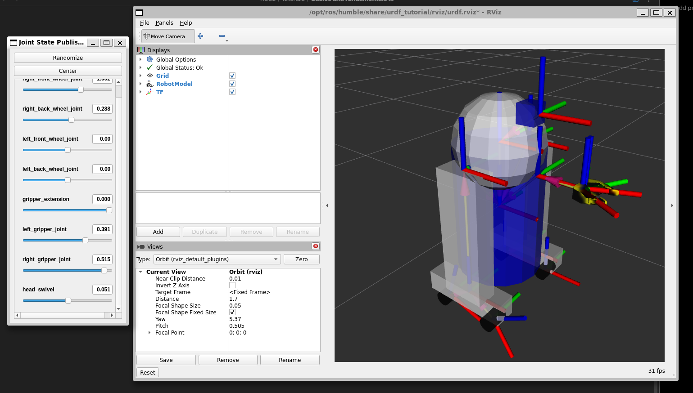
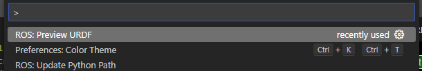
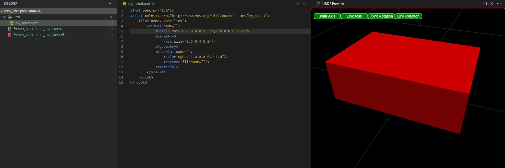
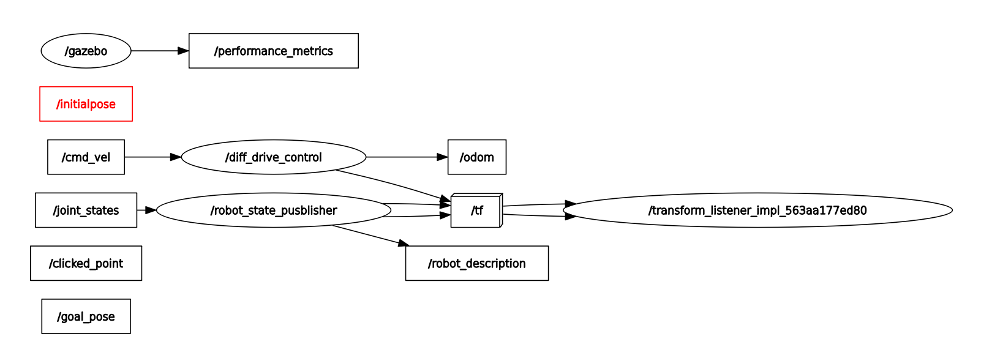

Note: Information recopiled from Udemy course https://www.udemy.com/course/ros2-tf-urdf-rviz-gazebo/

Steps:

- Writing a URDF
- Simulating in Gazebo
- Controlling the robot with Gazebo Plugin
- Packaging the application

# Intro to TF (Transforms)

## Visualize the Tf on the bot

First we need to install the URDF project with we will work.

```bash
sudo apt-get install ros-humble-urdf-tutorial
```

```bash
ros2 launch urdf_tutorial display.launch.py model:=08-macroed.urdf.xacro
```

Need to go to the path of the file to call this command, otherwise, you need to add all the path on the model.

```bash
/opt/ros/humble/share/urdf_tutorial/urdf
```



## Tf Tree

```bash
sudo apt-get install ros-humble-tf2-tools
```

```bash
ros2_lvl2 git:(master) ros2 run tf2_tools view_frames
[INFO] [1694552584.786185129] [view_frames]: Listening to tf data for 5.0 seconds...
[INFO] [1694552589.834421355] [view_frames]: Generating graph in frames.pdf file...
```

This create a PDF file in the same path that you called.

[PDF with the frames](attachments/frames_2023-09-12_16.03.09.pdf)

The problem that solve the TF is:

- **Keep a structured tree for all the joints/frames over time**
- We use the URDF file and ROS package

## Create a URDF file

**U**nified **R**obot **D**escription **F**ormal, contains the description of all the elements in a robot, this also generate the TFs.

We can use the tool mentioned before or use the extension of **_ROS_** that VSCode already have.
To use the extension of VSCode, we need to press `ctrl + shift + p` and search for


With this, we open a side windows with the preview of the **_URDF_**



Before we move the link to the position that we want, we also move first the joint, when we have the joint with the desired position, we can move now the visual (link)

http://wiki.ros.org/urdf/XML

The revolute and prismatic joints have the properties of limit

```xml
<origin xyz="0.0 0.0 0.2" rpy="0.0 0.0 0.0"/>
<parent link="base_link"/>
<child link="second_link"/>
<axis xyz="0.0 0.0 1.0"/>
<limit lower="0.0" upper="0.0" velocity="0.0" effort="0.0"/>
```

The continuous joint had the same properties but without the limit (it's continuous).

## Create a launch file for URDF

### C++ way

```shell
ros2 pkg create my_robot_description
```

```shell
cd my_robot_description && mkdir urdf
```

```shell
mv path_to_urdf/ /my_robot_description/urdf
```

After this, go to CMakeList.txt and add

```txt
install(
DIRECTORY urdf
DESTINY share/${PROJECT_NAME}/
)
amen_package()
```

### Python way

```shell
ros2 pkg create my_robot_description --buidl-type ament_python
```

```shell
cd my_robot_description && mkdir urdf
```

```shell
mv path_to_urdf/ /my_robot_description/urdf
```

After this, go to setup.py and add

```python
from setuptools import setup
import os
from glob import glob

package_name = 'my_robot_description'

setup(
    name=package_name,
    version='0.0.0',
    packages=[package_name],
    data_files=[
        ('share/ament_index/resource_index/packages',
            ['resource/' + package_name]),
	  ('share/' + package_name, ['package.xml']),
	  (os.path.join('share', package_name, 'urdf'), glob('urdf/*')), #New line
	  (os.path.join('share', package_name, 'launch'), glob('launch/*')), #New line

    ],
   ...
```

With both case we should run `colcon build` and `source install/setup.sh`

## Launch

### XML way

```xml
<?xml version="1.0"?>
<launch>
    <let name="urdf_path"
        value="$(find-pkg-share my_robot_description)/urdf/my_robot.urdf" />

    <let name='rviz_config_path'
        value="$(find-pkg-share my_robot_description)/rviz/urdf_config.rviz"/>

    <node pkg="robot_state_publisher" exec="robot_state_publisher">
        <param name ="robot_description"
            value="$(command 'xacro $(var urdf_path)')"/>
    </node>

    <node pkg="joint_state_publisher_gui" exec="joint_state_publisher_gui" output="screen"/>
    <node pkg="rviz2" exec="rviz2" output="screen"
        args="-d $(var rviz_config_path)" />

</launch>
```

To launch this `ros2 launch my_robot_description display.launch.xml`

### Python way

```python
import os
from ament_index_python.packages import get_package_share_directory
from launch import LaunchDescription
from launch_ros.actions import Node
import xacro


def generate_launch_description():
    """Launch my robot node"""
    # Get the path to the URDF file
    urdf_path = os.path.join(get_package_share_directory('my_robot_description'),'urdf/my_robot.urdf')
    robot_urdf = xacro.process_file(urdf_path)

    rviz_path = os.path.join(get_package_share_directory('my_robot_description'),'rviz/urdf_config.rviz')

    robot_state_publisher = Node(
        package='robot_state_publisher',
        executable='robot_state_publisher',
        name='robot_state_pusblisher',
        parameters=[
            {'robot_description': robot_urdf.toxml()},
        ]
    )

    joint_state_publisher_gui = Node(
        package='joint_state_publisher_gui',
        name='joint_state_publisher_gui',
        executable='joint_state_publisher_gui',
        output='screen'
    )

    rviz2 = Node(
        package='rviz2',
        executable='rviz2',
        name='rviz2',
        output='screen',
        arguments=['-d' , rviz_path]
    )

    return LaunchDescription([robot_state_publisher, joint_state_publisher_gui, rviz2])
```

## Improve the URDF with Xacro

We can add:

- Properties (Variables)
- Macros (Functions)

**_Note_**: using `colcon build --symlink-install` create a symbolic link to the file, so, we don't need to run the command `colcon build` every time we make a change

```xml
<xacro:property name="base_length" value="0.6" />
```

### Macros

The macros are the functions on `xacros`.

```xml
    <xacro:macro name="example_macro" params="a b c ">
        <link name="dummy_link">
            <visual>
                <geometry>
                    <box size=" ${a} ${b} ${c}"/>
                </geometry>
            </visual>
        </link>
    </xacro:macro>
<xacro:example_macro a="2" b="1" c="3" />
...
```

Like any other language, we can create files and import this to the main file.

# Gazebo Simulation

For the simulation on Gazebo, we need to add to the URDF some physical properties, like mass, inertial and collision models.

For simple objects we can use the section of _List of 3D inertia tensors_ from wikipedia

https://en.wikipedia.org/wiki/List_of_moments_of_inertia

For more complex objects, the CAD with we model the object should give us the inertia.

## Collision

The collision model is equal to the visual of the link, but when we work with _meshes_ is better to approximate the visual to a simple form, like a box, cylinder or sphere.

## Spawn Robot on Gazebo

Like the other section, to launch a file we have to ways.

### XML

```xml
<?xml version="1.0"?>
<launch>
    <let name="urdf_path"
        value="$(find-pkg-share my_robot_description)/urdf/my_robot.urdf.xacro" />

    <let name='rviz_config_path'
        value="$(find-pkg-share my_robot_description)/rviz/urdf_config.rviz"/>

    <node pkg="robot_state_publisher" exec="robot_state_publisher">
        <param name ="robot_description"
            value="$(command 'xacro $(var urdf_path)')"/>
    </node>

    <node pkg="rviz2" exec="rviz2" output="screen"
        args="-d $(var rviz_config_path)" />

   <include file="$(find-pkg-share gazebo_ros)/launch/gazebo.launch.py"/>

<node name="gazebo_ros" pkg="gazebo_ros" exec="spawn_entity.py"
    args="-topic robot_description -entity my_robot"
     output="screen"/>

</launch>
```

### Python

```python
import os
from ament_index_python.packages import get_package_share_directory
from launch import LaunchDescription
from launch_ros.actions import Node
import xacro
from launch.actions import IncludeLaunchDescription
from launch.launch_description_sources import PythonLaunchDescriptionSource


def generate_launch_description():
    """Launch my robot node"""
    # Get the path to the URDF file
    urdf_path = os.path.join(get_package_share_directory('my_robot_description'),'urdf/my_robot.urdf.xacro')
    robot_urdf = xacro.process_file(urdf_path)

    rviz_path = os.path.join(get_package_share_directory('my_robot_description'),'rviz/urdf_config.rviz')

    robot_state_publisher = Node(
        package='robot_state_publisher',
        executable='robot_state_publisher',
        name='robot_state_pusblisher',
        parameters=[
            {'robot_description': robot_urdf.toxml()},
        ]
    )

    rviz2 = Node(
        package='rviz2',
        executable='rviz2',
        name='rviz2',
        output='screen',
        arguments=['-d' , rviz_path]
    )

    gazebo_ros = Node(
        package='gazebo_ros',
        executable='spawn_entity.py',
        arguments=[
            '-topic', 'robot_description',
            '-entity', 'my_robot'
        ]
    )

    gazebo_launch_description = IncludeLaunchDescription(
        PythonLaunchDescriptionSource(
            os.path.join(
                get_package_share_directory('gazebo_ros'),
                'launch',
                'gazebo.launch.py'
            )
        )
    )

    return LaunchDescription([robot_state_publisher, rviz2,
                              gazebo_ros,
                              gazebo_launch_description])
```

It's very similar to the launch of `rviz`, the thing we do here is add the `gazebo_ros` package and delete the `joint_state_publisher_gui`

## Colors

Normally the gazebo don't load the colors of the materials (like rviz), so, to do that, we need to add some tag to load this.

```xml
<?xml version="1.0"?>
<robot xmlns:xacro="http://www.ros.org/wiki/xacro">

    <gazebo reference="base_link">
        <material>Gazebo/Blue</material>
    </gazebo>

</robot>
```

## Control de robot

### Plugin

```xml
    <gazebo>
        <plugin name="diff_drive_control" filename="libgazebo_ros_diff_drive.so">
            <!-- Update rate in Hz -->
            <update_rate>50</update_rate>
            <!-- wheels -->
            <left_joint>base_left_wheel_joint</left_joint>
            <right_joint>base_right_wheel_joint</right_joint>
            <!-- kinematics -->
            <wheel_separation>0.45</wheel_separation>
            <wheel_diameter>0.2</wheel_diameter>
            <!-- output -->
            <publish_odom>true</publish_odom>
            <publish_odom_tf>true</publish_odom_tf>
            <publish_wheel_tf>true</publish_wheel_tf>
            <odometry_topic>odom</odometry_topic>
            <odometry_frame>odom</odometry_frame>
            <robot_base_frame>base_footprint</robot_base_frame>

        </plugin>
    </gazebo>
```

To looking for more plugins

https://github.com/ros-simulation/gazebo_ros_pkgs



### Launch Robot + World

For the xml file, we change the `tag` of include for this

```xml
...
    <include file="$(find-pkg-share gazebo_ros)/launch/gazebo.launch.py">
        <arg name="world" value="$(find-pkg-share my_robot_bringup)/world/my_world.world" />
    </include>
...
```

And for the python file, we add the path of the world file and add this path to the arguments of `IncludeLaunchDescription`

```python
...
world_directory = os.path.join(get_package_share_directory('my_robot_bringup'), 'world/my_world.world')
...
    gazebo_launch_description = IncludeLaunchDescription(
        PythonLaunchDescriptionSource(
            os.path.join(
                get_package_share_directory('gazebo_ros'),
                'launch',
                'gazebo.launch.py'
            )
        ),
        launch_arguments={'world': world_directory}.items(),
    )

```

# Sensors

```xml
<?xml version="1.0"?>
<robot xmlns:xacro="http://www.ros.org/wiki/xacro">

    <xacro:property name="camera_length" value="0.01" />
    <xacro:property name="camera_width" value="0.1" />
    <xacro:property name="camera_height" value="0.05" />


    <link name="camera_link">
        <visual>
            <geometry>
                <box size="${camera_length} ${camera_width} ${camera_height}" />
            </geometry>
            <material name="grey" />
        </visual>
        <collision>
            <geometry>
                <box size="0.01 0.1 0.05" />
            </geometry>
        </collision>
        <xacro:box_inertia m="0.1" l="${camera_length}" w="${camera_width}" h="${camera_height}"
            xyz="0.0 0.0 0.0" rpy="0 0 0" />
    </link>


    <joint name="base_camera_joint" type="fixed">
        <parent link="base_link" />
        <child link="camera_link" />
        <origin xyz="${(base_length + camera_length) / 2.0 } 0.0 ${base_height / 2.0}"
            rpy="0.0 0.0 0.0" />
    </joint>

    <joint name="camera_optical_joint" type="fixed">
        <!-- these values have to be these values otherwise the gazebo camera
            image won't be aligned properly with the frame it is supposedly
            originating from -->
        <origin xyz="0 0 0" rpy="${-pi/2} 0 ${-pi/2}" />
        <parent link="camera_link" />
        <child link="camera_link_optical" />
    </joint>

    <link name="camera_link_optical">
    </link>
    <gazebo reference="camera_link">
        <material>
            Gazebo/Red
        </material>
        <sensor name="camera_sensor" type="camera">
            <pose>0 0 0 0 0 0</pose>
            <visualize>true</visualize>
            <update_rate>10.0</update_rate>
        </sensor>
        <plugin name="camera_controller" filename="libgazebo_ros_camera.so">
            <frame_name>camera_link_optical</frame_name>
        </plugin>
    </gazebo>


</robot>
```

[Complete TF](attachments/complete_robot.pdf)
